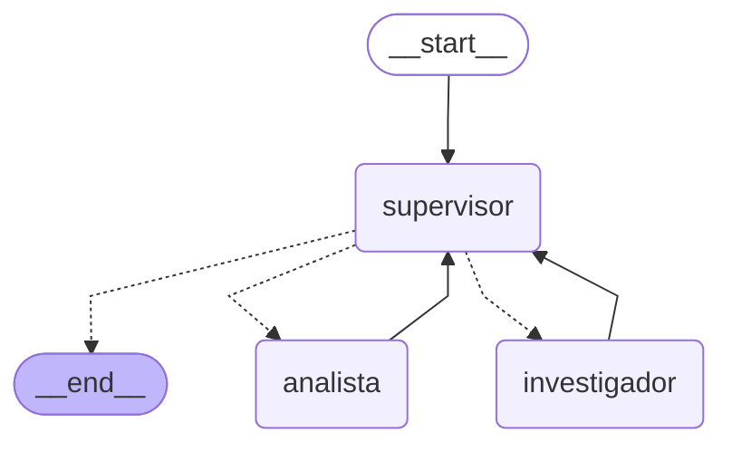

# Pre-entrega 6 — Orquestador Multi-Agente de Analisis e Investigacion

Prototipo funcional de un orquestador jerarquico: un nodo **Supervisor**
rutea dinamicamente entre dos especialistas (**Investigador** y
**Analista**) hasta decidir que la tarea esta completa y sintetizar una
respuesta final — sin un flujo fijo de pasos, el Supervisor decide en cada
momento que hace falta en base a la conversacion real.

Continua el dominio ficticio del "Sistema de Pedidos Online" de las Fases
3-5: el Investigador consulta la misma Vector DB indexada en la Fase 3; el
Analista procesa los datos que trae el Investigador (en esta demo,
convierte tiempos de SLA a una unidad comun y calcula un promedio).

## Topologia elegida y por que

**Jerarquica con Supervisor central** (en vez de, por ejemplo, un pipeline
lineal fijo Investigador → Analista, o que los agentes se llamen entre si
directamente):

- El Supervisor es el **unico** que decide el flujo, en base al estado real
  de la conversacion (que ya se investigo, que ya se calculo) — no hay
  rutas `if`/`else` fijas ni un orden de pasos hardcodeado. Si una pregunta
  no necesita analisis numerico, el Supervisor puede ir directo a FINISH
  despues de investigar; si necesita mas de una ronda de investigacion,
  puede volver a mandar al Investigador.
- Mantiene a los especialistas **desacoplados entre si**: ninguno sabe que
  existe el otro, ambos solo saben hablar con el Supervisor. Agregar un
  tercer especialista (ej. un agente de "Redaccion") no requiere tocar a
  los dos existentes, solo al Supervisor.
- Centraliza el **manejo de conflictos**: si un especialista devuelve algo
  incompleto o inconsistente, el Supervisor (que ve el resultado antes que
  el usuario) es el que decide si hace falta reintentar con el mismo
  especialista, derivar al otro, o seguir igual — nunca el usuario ve un
  resultado a medio terminar de un especialista individual.

## Diagrama del grafo



(Generado con `app.get_graph().draw_mermaid()` — no con
`draw_mermaid_png()`, que requiere un servicio de renderizado externo o
Graphviz local; el texto Mermaid se renderiza nativamente en GitHub, sin
esa dependencia extra.)

## Arquitectura

- `state.py`: `OrchestratorState` (hereda de `MessagesState`) +
  `next_agent` (a donde rutea la proxima arista condicional),
  `task_completed`, y `contribuciones` (lista acumulativa — reducer
  `operator.add` — de que aporto cada especialista, en orden). Esa lista es
  la forma concreta en la que este sistema **evita perder contexto** en la
  comunicacion entre agentes: el Supervisor siempre puede ver un resumen de
  todo lo que ya se investigo/analizo, no solo el ultimo mensaje.
- `agents/research_agent.py`: especialista de Investigacion. Una
  herramienta (`buscar_en_base_de_conocimiento`) que hace busqueda
  semantica simulada sobre la Vector DB de la Fase 3 (ChromaDB local, el
  corpus del Sistema de Pedidos Online) — la consigna permite
  explicitamente esta alternativa a Tavily. Armado con
  `create_react_agent` (su propio mini-ciclo ReAct, puede llamar la
  herramienta mas de una vez si hace falta).
- `agents/analyst_agent.py`: especialista de Analisis. Una herramienta
  (`calcular_estadisticas`) que hace la aritmetica (promedio, min, max,
  suma) sobre una lista de numeros — el LLM del propio agente es
  responsable de convertir unidades heterogeneas (minutos, horas, dias) a
  una escala comun antes de llamar a la herramienta.
- `graph.py`: el nodo **Supervisor** usa salida estructurada
  (`with_structured_output(SupervisorDecision)`, Pydantic con un campo
  `Literal["investigador", "analista", "FINISH"]`) para decidir el proximo
  paso; esa decision se mapea a una arista condicional
  (`add_conditional_edges`). Cuando decide `FINISH`, tambien genera la
  **sintesis final** combinando los aportes de ambos especialistas.
- `main.py`: corre la demo completa y guarda la traza en
  `traces/ejemplo_flujo_delegacion.json`.
- `demo_flujo_delegacion.ipynb`: notebook ejecutado que demuestra el flujo
  de delegacion paso a paso (alternativa al video corto que pide la
  consigna).

## Como correrlo

Requiere `GROQ_API_KEY` en el `.env` (reutilizada de fases anteriores). La
primera corrida indexa automaticamente la Vector DB de la Fase 3 si todavia
no se habia corrido (ver `fase3_rag_local/README.md`).

```bash
python -m fase6_orquestador_multiagente.main
```

## Evidencia: flujo de delegacion real (no simulado)

Pregunta: *"Investiga en la base de conocimiento los tiempos de respuesta
comprometidos por severidad de soporte, y calculame el promedio en horas."*

1. **Supervisor → investigador**: *"Falta obtener la información factual
   sobre los tiempos de respuesta comprometidos... antes de poder calcular
   el promedio."*
2. **Investigador** busca en la Vector DB y encuentra la politica de SLA
   (`politicas_soporte.md`): Severidad 1 < 30 min, Severidad 2 < 4h
   habiles, Severidad 3 < 2 dias habiles.
3. **Supervisor → analista**: *"Ya se obtuvo la información factual...
   falta convertir a horas y calcular el promedio."*
4. **Analista** convierte las unidades (0.5h, 4h, 16h) y calcula el
   promedio: **≈ 6.83 horas**.
5. **Supervisor → FINISH**: sintetiza la respuesta final combinando ambos
   aportes.

Traza completa (mensajes + contribuciones registradas) en
[`traces/ejemplo_flujo_delegacion.json`](traces/ejemplo_flujo_delegacion.json).

## Tests sinteticos

`tests/test_fase6_orchestrator.py` (en la raiz del repo): las herramientas
de forma determinista, y el ruteo del grafo con un Supervisor falso
(decisiones prefijadas) y especialistas falsos (sin `create_react_agent`
real ni LLM real) — confirma el flujo completo
investigador→analista→FINISH, que los especialistas no se llaman cuando no
hace falta, y que el **criterio de suficiencia estricto**
(`MAX_CONTRIBUCIONES`) corta el ciclo aunque el Supervisor nunca decida
terminar por si solo (el "Supervisor Infinito" que advierte la consigna).

```bash
python -m pytest tests/test_fase6_orchestrator.py -v
```

## Errores comunes evitados

- **El "Supervisor Infinito"**: dos capas de proteccion — `recursion_limit`
  externo en cada invocacion del grafo, y un criterio de suficiencia
  estricto dentro del propio nodo Supervisor (`MAX_CONTRIBUCIONES`) que
  fuerza `FINISH` sin ni siquiera llamar al LLM una vez mas si ya se
  acumularon demasiadas contribuciones.
- **Contaminacion de contexto**: los especialistas NO reciben todo el
  historial de mensajes del sistema (incluidas las tool calls y
  decisiones internas del Supervisor), solo la pregunta original del
  usuario (y, en el caso del Analista, el resumen de lo que encontro el
  Investigador) — `_ultima_instruccion()` en `graph.py`.
- **Resumenes truncados que mienten**: una version inicial truncaba el
  resumen de cada contribucion a 300 caracteres para guardarlo en el
  estado. En la practica, esto cortaba tablas de datos a mitad de fila, el
  Supervisor interpretaba que la informacion estaba incompleta, y volvia a
  pedirle al Investigador lo mismo 3-4 veces de mas (el sintoma real del
  "Supervisor Infinito", encontrado corriendo la demo, no en teoria). Fix:
  las contribuciones ya no se truncan.
- **El Supervisor "atajando" el calculo en vez de delegarlo**: en otra
  corrida real (ver el notebook), el Investigador incluyo una columna
  propia de "equivalente en horas" en su resumen (pese a que su prompt
  decia "no hagas calculos"), y el Supervisor aprovecho esos numeros para
  escribir el promedio el mismo en `respuesta_final` — sin pasar por el
  Analista, y con una conversion **incorrecta** (calculo "2 dias habiles"
  como 48h en vez de 16h). Fix de dos partes: (1) el prompt del
  Investigador ahora exige reportar los valores EXACTAMENTE como aparecen
  en la fuente, sin ninguna conversion propia; (2) el prompt del
  Supervisor ahora prohibe explicitamente que haga el calculo el mismo,
  aunque le parezca trivial, y lo obliga a rutear al Analista al menos una
  vez si la pregunta original pedia una operacion matematica. Verificado
  en corridas repetidas tras el fix: el Analista siempre interviene y el
  promedio da consistentemente 6.83 horas.
