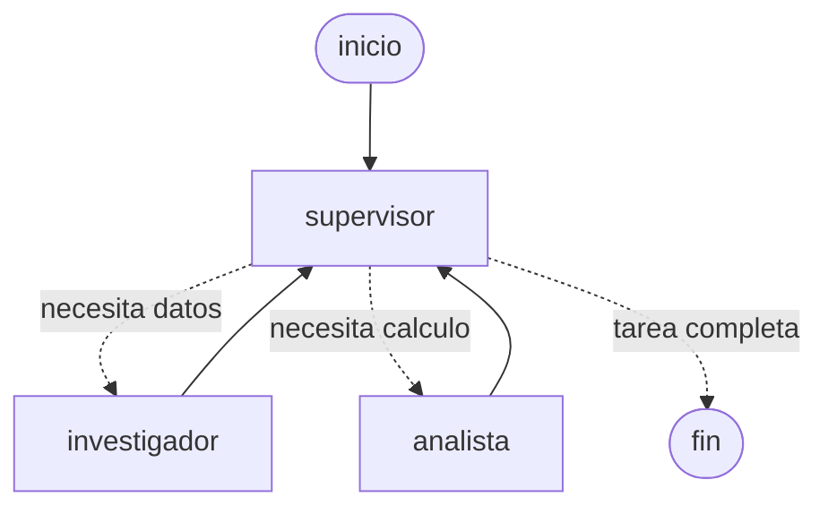
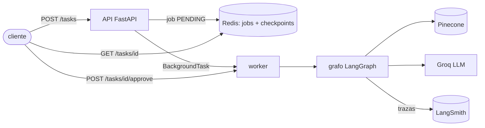

# Sistema Final: Intelligence System

Sistema de IA completo que integra **RAG híbrido**, **agentes con Supervisor**,
una **API asíncrona documentada** y **trazabilidad** en LangSmith. Recibe una
pregunta que requiere conocimiento específico y razonamiento en varios pasos,
y devuelve una respuesta con sus fuentes y contribuciones.

Es la unificación de las pre-entregas: el RAG de la Fase 4 (Pinecone + BM25),
las herramientas y el Supervisor de la Fase 6, la API y el Human-in-the-loop
de la Fase 7. El paquete `sistema_final/` no importa nada de las carpetas de
fases anteriores.

## Arquitectura



- **Supervisor** (`supervisor.py`): decide en cada paso a quién rutea
  (`investigador`, `analista` o `FINISH`). La decisión es una salida
  estructurada validada con Pydantic, no un `if` fijo.
- **Investigador**: usa la herramienta `buscar_en_base_de_conocimiento`, que
  hace búsqueda híbrida (Pinecone semántico + BM25 léxico) sobre el corpus del
  Sistema de Pedidos Online.
- **Analista**: usa `calcular_estadisticas` (promedio, mínimo, máximo, suma).
- **Gate HITL**: antes del analista el grafo se pausa con `interrupt()` y el
  job queda `AWAITING_APPROVAL` hasta que un humano aprueba o rechaza.
- **Persistencia**: el checkpointer de Redis guarda el estado del grafo, así
  que una pausa sobrevive a un reinicio del servidor.



## Estructura

```
sistema_final/
├── config.py            # toda la configuracion sale de variables de entorno
├── supervisor.py        # Supervisor + ruteo + criterio de suficiencia
├── graph.py             # composicion del grafo, checkpointer y gate HITL
├── state.py             # estado compartido (OrchestratorState)
├── hitl.py              # que es una accion critica y su payload de aprobacion
├── worker.py            # ejecuta el grafo en segundo plano y actualiza el estado
├── job_store.py         # estado de cada job en Redis (con TTL)
├── redis_checkpointer.py# checkpointer de LangGraph sobre Redis
├── observability.py     # trazas de LangSmith
├── agents/
│   ├── research.py      # Investigador + herramienta de busqueda (validada)
│   └── analyst.py       # Analista + herramienta de calculo (validada)
├── rag/
│   ├── hybrid.py        # recuperador hibrido Pinecone + BM25
│   ├── pinecone_retriever.py
│   ├── ingest.py        # ingesta idempotente del corpus
│   ├── ingestion_pipeline.py, pinecone_setup.py, chunking.py, embeddings.py
├── api/main.py          # API FastAPI con validacion Pydantic de entradas y salidas
├── data/                # corpus del Sistema de Pedidos Online (Markdown)
├── scripts/             # prueba de carga y exportacion de metricas de LangSmith
├── metrics/             # resultados reales de la prueba de carga y de LangSmith
└── tests/test_sistema_final.py
```

## Cómo levantarlo

Requisitos: Python 3.12 o superior. En Windows, clonar el repo en una ruta
corta (ver el README de Fase 7: el límite de 260 caracteres rompe `langsmith`).

1. Copiar `.env.example` a `.env` y completar `GROQ_API_KEY`,
   `PINECONE_API_KEY`, `REDIS_URL` y `LANGSMITH_API_KEY`.
2. Instalar dependencias: `pip install -r requirements.txt`.
3. Levantar todo con un comando:

   ```bash
   ./run.sh
   ```

   Indexa el corpus (es idempotente: solo reindexa lo que cambió) y arranca la
   API en `http://127.0.0.1:8000`. Documentación interactiva en `/docs`.

## Cómo usarlo

```bash
# Crear una tarea
curl -X POST http://127.0.0.1:8000/tasks -H "Content-Type: application/json" \
  -d '{"pregunta": "Que base de datos usa el sistema de pedidos?"}'
# -> {"job_id": "...", "status": "PENDING"}

curl http://127.0.0.1:8000/tasks/<job_id>
# -> PENDING -> RUNNING -> DONE (con resultado y contribuciones)

# Una pregunta que requiere calculo pausa el job en HITL
curl http://127.0.0.1:8000/tasks/<job_id>
# -> status AWAITING_APPROVAL, con interrupt_payload

curl -X POST http://127.0.0.1:8000/tasks/<job_id>/approve \
  -H "Content-Type: application/json" -d '{"aprobado": true}'
# -> el analista corre y el job pasa a DONE (o REJECTED si se rechaza)
```

Entradas inválidas (por ejemplo una pregunta de menos de 3 caracteres) se
rechazan con 422 antes de encolar nada.

## Validación de entradas

| Dónde | Qué se valida |
|---|---|
| `POST /tasks` | `pregunta`: texto de 3 a 1000 caracteres |
| `POST /tasks/{id}/approve` | `aprobado`: booleano |
| `buscar_en_base_de_conocimiento` | `query`: texto de 3 a 500 caracteres |
| `calcular_estadisticas` | `valores`: lista de 1 a 500 números, todos finitos (sin NaN ni infinito) |
| Salida del Supervisor | `SupervisorDecision`: decisión en el conjunto cerrado de agentes |

## Observabilidad

Cada job genera una traza `ejecutar_job` en LangSmith con el árbol completo
(supervisor, investigador, analista, llamadas al LLM y a la herramienta). Un
job que pasa por la aprobación humana genera dos trazas: el tramo hasta la
pausa y el tramo de reanudación (`LangGraph`), con el mismo `job_id`.

Las trazas de esta corrida están en el proyecto de LangSmith
`proyecto-ch-ai-final` (configurable con `LANGSMITH_PROJECT`). Las capturas de
observabilidad de la Fase 7 están en
[fase7_api_produccion/screenshots/](../fase7_api_produccion/screenshots/):
lista de trazas, traza con la pausa HITL y tramo de reanudación. Las capturas
del sistema final todavía no están tomadas.

## Pruebas

- **Pruebas del sistema** (`sistema_final/tests/`): 16 pruebas sin Groq,
  Redis ni Pinecone reales. Cubren la validación Pydantic de la API y de las
  herramientas, el `JobStore`, el ruteo del Supervisor, la pausa HITL y su
  reanudación, el rechazo, y que una excepción deja el job en `FAILED`.

  ```bash
  python -m pytest sistema_final/tests -v
  ```

- **Prueba de carga real**: 5 peticiones concurrentes contra la API con
  Groq, Pinecone, Redis y LangSmith reales:

  ```bash
  python -m sistema_final.scripts.load_test
  python -m sistema_final.scripts.export_metrics
  ```

## Resultados reales

Prueba de carga (5 peticiones concurrentes, `MAX_JOBS_CONCURRENTES=2`):

| Pregunta | Estado | Latencia |
|---|---|---|
| Cuantos pedidos tuvo el cliente 102 y cual fue el total? | DONE | 199.6 s |
| Que base de datos usa el sistema de pedidos para persistencia? | DONE | 9.2 s |
| Investiga los tiempos de respuesta comprometidos... y calculame el promedio en horas | DONE | 104.6 s |
| Que pasa si el health check de Kubernetes falla despues de un despliegue? | DONE | 10.3 s |
| Por que puede aparecer stock insuficiente en pedidos que si tienen stock? | DONE | 37.9 s |

- 5/5 jobs `DONE`, sin fallos. Latencia p95: 199.6 s. Promedio: 72.3 s.
- Una pregunta pasó por el gate HITL, se aprobó automáticamente en la prueba y completó.
- LangSmith: 6 trazas (5 jobs y 1 tramo de reanudación), costo total
  US$ 0.0075, p95 de 198.3 s según LangSmith.

Lectura de la latencia: el tier gratuito de Groq limita a 8 000 tokens por
minuto. Con 5 peticiones en paralelo hubo reintentos por 429 que el cliente
absorbió con backoff, y el semáforo de concurrencia puso jobs en cola. La
latencia viene de esa cuota, no del diseño del grafo.

## Decisiones de diseño

- **Persistencia propia en Redis**: `langgraph-checkpoint-redis` necesita los
  comandos RediSearch (`FT.*`), que el Redis gratuito de Upstash no soporta.
  El checkpointer propio usa solo GET, SET, RPUSH, LRANGE y SCAN.
- **Índice reutilizado**: el corpus ya está indexado en el índice de la Fase 4,
  así que el default de `PINECONE_INDEX_NAME` es ese. Cambiarlo en `.env` no
  requiere tocar código.
- **Async**: el grafo, la API y el worker son asíncronos. Pinecone y los
  embeddings locales son síncronos, así que se ejecutan en un thread con
  `asyncio.to_thread` (vía `ainvoke`), sin bloquear el event loop.

## Limitaciones conocidas

- El despliegue local es con `run.sh` (no hay imagen de Docker en esta fase; no era requisito).
- El tier gratuito de Groq define la latencia de la prueba de carga.
- La prueba de carga usa 5 muestras: el p95 es, en la práctica, la petición más lenta.
